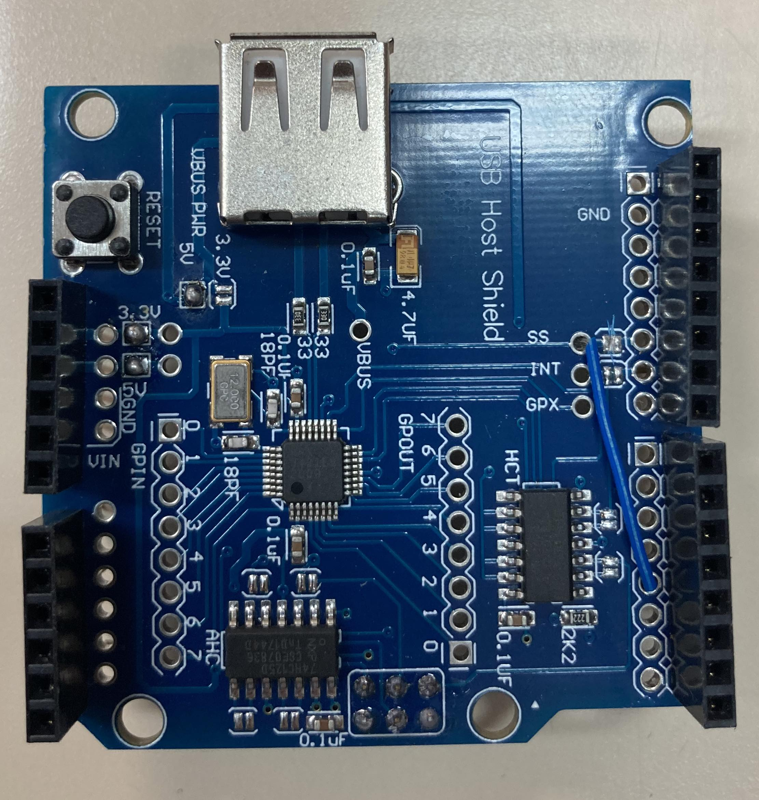

# Construction instructions

- 3D print the three pieces
- Purchase / obtain the rest of the parts from the [Parts list](PartsList.md)

You will need a soldering iron, some wire, and a little experience for this part

## Bottom layer:
- The bottom layer is the UNO board (this does not require any modifications)

## Middle layer:
- The middle layer is the USB host shield.
-  Cut the solder jumper connector of SS, and solder a wire from SS to pin 2 (4th from the end, NOT on the side with the reset button)
- Solder the 3.3V and 5V jumpers (next to the reset button), and the 5V jumper next to where it is written VBUS PWR
(this is due to manufacturing issues with these boards, see an [explanation](https://esp8266-notes.blogspot.com/2017/08/defective-arduino-usb-host-shield-boards.html) )

## Front piece:
- The front piece holds the LED. Place the red-green LED in the mounting clip, and mount it in the front piece. Solder the three legs as follows:
  * shortest leg (green) to the 100 ohm resistor then to a piece of wire
  * middle length (red) to the 150 ohm resistor then to a piece of wire
  * longest leg to a piece of wire
- Place shrink wrap around the resistors and the connections

## Top layer:
- The top layer is the data logging shield
- Make sure there is a battery in the holder (will need to then set the time)
- Solder CD to pin 4 (on the side of the board with the reset button)
- Solder the connection from the green LED (shortest leg), i.e. after the resistor, to pin 7 
- Solder the connection from the red LED (middle length), i.e. after the resistor, to pin 8 
- Solder the connection from the ground (longest leg) to a GND pin 
- Bend the IOREF and RST pins (next to the battery), and the SCL and SDA pins so it fits on the USB host shield

## Combining the pieces
- Once the three pieces are joined they should be placed inside the box. Place the M2 nuts in the holes in the screw holder. Slide the board inside the box. Hold the screw holder with one hand (to keep the nuts in place), and insert the screws from underneath (and tighten them)

- The front piece is held on by friction, there is a small hole to pry it off using a small screwdriver or similar

## Arduino

- Connect the board to a computer. In the arduino IDE, you will need to install the following libraries:
  * Time
  * DS1307RTC
  * SdFat
  * USB Host Shield Library v2.0
- Note that you need to change one line in one of the libraries:
  * In the file UsbCore.h (in Documents/Arduino/libraries/USB_Host_Shield_Library_2.0) this line to:

// typedef MAX3421e<P3, P9> MAX3421E; // Official Arduinos (UNO, Duemilanove, Mega, 2560, Leonardo, Due etc.), Intel Edison, Intel Galileo 2 or Teensy 2.0 and 3.x

- Before first use or if the battery is replaced, the date and time needs to be set. This can be performed using the example program "TimeRTCSet" from the [time library](https://github.com/PaulStoffregen/Time), note that you will also need to run the Processing script

# Usage
- Now the keyboard can be connected. It can be powered from the computer, or using a USB wall adapter. For testing, it is recommended first to use it with a computer so you can see that the notes are being recorded (using the serial monitor in the Arudino IDE)

- The device will create a new comma separated file (.csv) file for every day that it is used. The files will contain a time stamp, the event (key press or key release), and the volume (if this is not supported, the same number will appear on every line) 

- The format of the file is as follows:
  * Date DD/MM/YYYY format
  * time HH:MM:SS.SSS format
  * event: 1 = press, 2 = release
  * channel
  * note (according to standard MIDI notes, e.g. 60 is middle C)
  * volume (if supported, otherwise will always be the same value)

For example:

13/09/2022,09:52:58.648,1,000,060,100

13/09/2022,09:52:58.650,2,000,060,064
